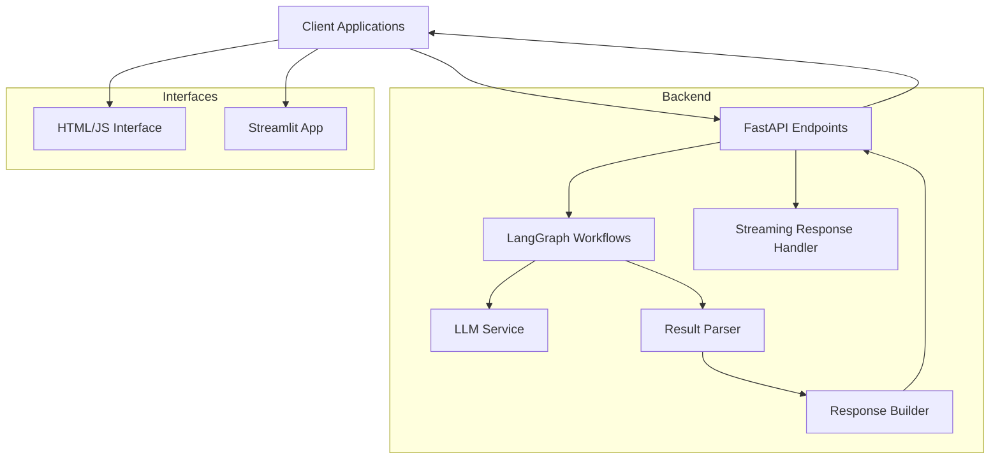
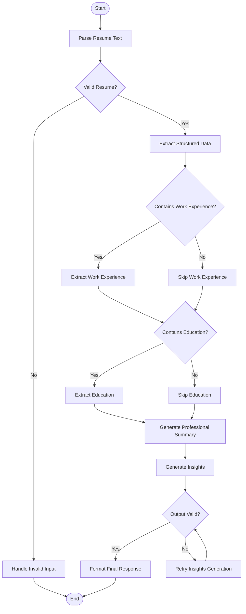
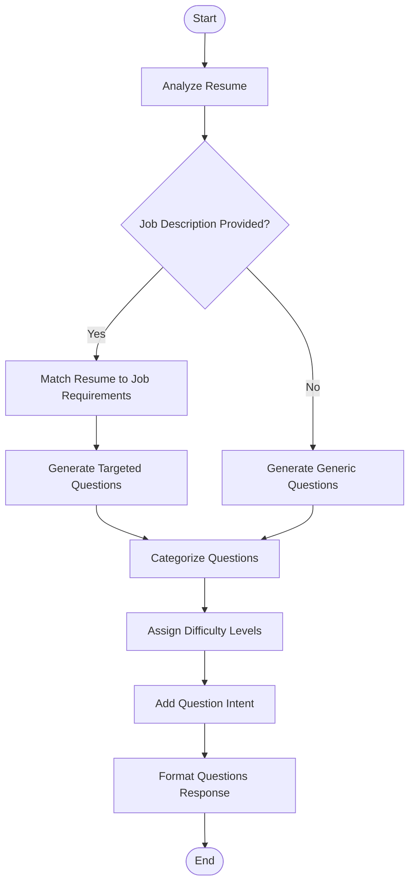

# Resume Analysis System

A sophisticated resume analysis system built with FastAPI, LangGraph, and Large Language Models (LLMs) that extracts structured information from resumes, generates professional insights, and creates tailored interview questions.
#Demo


https://github.com/user-attachments/assets/bb9b95c2-58ad-484c-8cdd-6d43c10e1462


## Table of Contents
- [Features](#features)
- [Architecture](#architecture)
- [LangGraph Workflows](#langgraph-workflows)
- [API Reference](#api-reference)
- [Installation & Setup](#installation--setup)
- [User Interfaces](#user-interfaces)
- [Project Structure](#project-structure)
- [Testing](#testing)
- [Performance & Scaling](#performance--scaling)
- [Troubleshooting](#troubleshooting)
- [Future Improvements](#future-improvements)
- [License](#license)

## Features

- **Resume Text Analysis**: Process raw resume text to extract structured information
- **Structured Data Extraction**: Parse contact details, work experience, education, and skills
- **Professional Insights**: Generate candidate strengths, improvement areas, career level assessment
- **Tailored Interview Questions**: Create custom questions based on resume content and job descriptions
- **Real-time Streaming Updates**: Get analysis progress in real-time using Server-Sent Events
- **Multiple User Interfaces**: HTML/CSS/JS interface and Streamlit app for improved user experience
- **Checkpoint Management**: Save and resume analysis state with unique tracking IDs
- **LangGraph Workflow**: Modular, composable graph-based architecture for controlled LLM orchestration

## Architecture

The system follows a modular architecture with clear separation of concerns between components:



### Key Components

1. **API Layer**: FastAPI endpoints for resume analysis, streaming, and question generation
2. **LangGraph Workflows**: Orchestrates LLM calls in structured graphs for different tasks
3. **LLM Service**: Connects to OpenAI/other providers for AI processing
4. **Parser & Validators**: Ensures responses match expected schemas
5. **Response Builder**: Constructs final API responses
6. **Streaming Handler**: Manages real-time updates through SSE
7. **User Interfaces**: Web UI and Streamlit options

## LangGraph Workflows

The application uses LangGraph to create structured processing workflows for different tasks:

### Resume Analysis Workflow



### Interview Questions Workflow



## API Reference

The REST API provides the following endpoints:

### 1. Resume Analysis Endpoint

```
POST /api/v1/analyze-resume
```

Analyzes a resume and returns structured data with professional insights.

**Request Body:**
```json
{
  "resume_text": "Full resume text content..."
}
```

**Response:**
```json
{
  "structured_data": {
    "name": "John Doe",
    "email": "johndoe@example.com",
    "phone": "(123) 456-7890",
    "location": "San Francisco, CA",
    "summary": "Experienced software engineer with...",
    "work_experience": [
      {
        "company": "Tech Company",
        "position": "Senior Software Engineer",
        "start_date": "2020-01",
        "end_date": "Present",
        "description": "Developed...",
        "skills": ["Python", "React", "AWS"]
      }
    ],
    "education": [
      {
        "institution": "University of California",
        "degree": "B.S.",
        "field_of_study": "Computer Science",
        "start_date": "2015",
        "end_date": "2019",
        "gpa": 3.8
      }
    ]
  },
  "insights": {
    "strengths": ["Strong technical skills in...", "..."],
    "improvement_areas": ["Could benefit from...", "..."],
    "key_skills": ["Python", "React", "AWS", "..."],
    "career_level": "Mid-Senior",
    "industry_fit": ["Software Development", "Web Development", "..."]
  }
}
```

### 2. Streaming Analysis Endpoint

```
POST /api/v1/analyze-resume-stream
GET /api/v1/analyze-resume-stream?resume_text=...
```

Streams the resume analysis process with real-time updates.

**Events Streamed:**
- `started`: Analysis has started
- `processing`: Processing initial resume text
- `work_experience_extracted`: Work experience extraction complete
- `education_extracted`: Education extraction complete
- `summary_generated`: Summary generation complete
- `insights_generated`: Insights generation complete
- `completed`: Analysis complete, includes full results
- `error`: Error during processing (includes error message)

### 3. Interview Questions Endpoint

```
POST /api/v1/resume-questions
```

Generates tailored interview questions based on resume content and optional job description.

**Request Body:**
```json
{
  "resume_text": "Full resume text content...",
  "job_description": "Job description to match against...",
  "num_questions": 5
}
```

**Response:**
```json
{
  "questions": [
    {
      "question": "Can you describe your experience with React and how you've used it in your projects?",
      "difficulty": "Medium",
      "category": "Technical",
      "intent": "To assess the candidate's hands-on experience with a key technology"
    },
    {
      "question": "Tell me about a time when you had to collaborate with cross-functional teams. What challenges did you face and how did you overcome them?",
      "difficulty": "Easy",
      "category": "Teamwork",
      "intent": "To evaluate the candidate's collaboration skills"
    }
  ],
  "overview": "These questions are tailored to assess the candidate's technical skills and experience in web development..."
}
```

## Installation & Setup

### Prerequisites

- Python 3.9+
- OpenAI API key or other LLM provider credentials

### Installation

1. Clone the repository:
   ```bash
   git clone https://github.com/yourusername/resume-analysis-app.git
   cd resume-analysis-app
   ```

2. Create a virtual environment and activate it:
   ```bash
   python -m venv venv
   source venv/bin/activate  # On Windows: venv\Scripts\activate
   ```

3. Install dependencies:
   ```bash
   pip install -r requirements.txt
   ```

4. Create a `.env` file with your LLM provider credentials:
   ```
   OPENAI_API_KEY=your_api_key_here
   MODEL_NAME=gpt-4o
   ```

### Running the API

Start the API server:
```bash
python -m app.main
```

The API server will run at http://localhost:8000 with documentation available at http://localhost:8000/docs.

## User Interfaces

### HTML/JS Interface

Access the web UI by opening http://localhost:8000/ui in your browser when the API is running.

### Streamlit Application

1. Install Streamlit requirements:
   ```bash
   pip install -r ui/streamlit_requirements.txt
   ```

2. Run the Streamlit app:
   ```bash
   cd ui
   streamlit run streamlit_app.py
   ```

3. Access the Streamlit UI at http://localhost:8501

## Project Structure

```
resume_analysis_app/
├── app/                            # Main application package
│   ├── api/                        # API endpoints
│   │   └── v1/                     # API version 1
│   │       └── endpoints.py        # API route handlers
│   │
│   ├── core/                       # Core configuration
│   │   ├── config.py               # Application configuration
│   │   └── cors.py                 # CORS settings
│   │
│   ├── graph/                      # LangGraph components
│   │   ├── builder.py              # Graph building functions
│   │   ├── nodes/                  # Graph node implementations
│   │   │   ├── education.py        # Education extraction node
│   │   │   ├── insights.py         # Insights generation node
│   │   │   ├── questions.py        # Questions generation node
│   │   │   ├── structure.py        # Structure extraction node
│   │   │   ├── summary.py          # Summary generation node
│   │   │   └── work_experience.py  # Work experience extraction node
│   │   └── validators.py           # Schema validation functions
│   │
│   ├── models/                     # Pydantic data models
│   │   ├── education.py            # Education models
│   │   ├── insights.py             # Insights models
│   │   ├── questions.py            # Questions models
│   │   ├── request.py              # Request models
│   │   ├── response.py             # Response models
│   │   ├── resume.py               # Resume models
│   │   └── work.py                 # Work experience models
│   │
│   ├── services/                   # Business logic services
│   │   ├── checkpoint_utils.py     # Checkpoint management
│   │   ├── llm_service.py          # LLM integration
│   │   └── parser.py               # Response parsing
│   │
│   ├── utils/                      # Utility functions
│   │   ├── logger.py               # Logging configuration
│   │   └── streaming.py            # Streaming response utils
│   │
│   └── main.py                     # FastAPI application entry point
│
├── tests/                          # Test modules
│   ├── conftest.py                 # Test configuration
│   ├── test_api/                   # API tests
│   ├── test_graph/                 # Graph tests
│   └── test_services/              # Service tests
│
├── ui/                             # User interfaces
│   ├── app.js                      # JS for web UI
│   ├── debug.js                    # Debug utilities
│   ├── direct_test.html            # Direct API test page
│   ├── force_display.html          # Test display page
│   ├── index.html                  # Main web UI
│   ├── streamlit_app.py            # Streamlit application
│   ├── STREAMLIT_README.md         # Streamlit documentation
│   ├── streamlit_requirements.txt  # Streamlit requirements
│   ├── styles.css                  # CSS for web UI
│   └── test_data.js                # Test data for UI
│
├── .env                            # Environment variables (not in repo)
├── .gitignore                      # Git ignore file
├── debug_api.py                    # API debugging script
├── LICENSE                         # License file
├── README.md                       # Main documentation
├── requirements.txt                # Python dependencies
└── start_streamlit_ui.bat          # Streamlit startup script
```

## Testing

### Unit Testing

Run the test suite with pytest:

```bash
pytest
```

For coverage report:

```bash
pytest --cov=app
```

### Manual API Testing

Use the debug script to test the API endpoints:

```bash
# Test all endpoints
python debug_api.py

# Test specific endpoint
python debug_api.py analyze  # Test analyze endpoint
python debug_api.py stream   # Test streaming endpoint
python debug_api.py questions  # Test questions endpoint
```

### UI Testing

1. Use the direct_test.html page for quick API testing through a browser interface
2. Use force_display.html to test UI rendering with sample data without API calls

## Performance & Scaling

### Current Performance

- Average resume analysis time: ~15-30 seconds (depends on resume length)
- Average questions generation time: ~10-20 seconds
- Streaming updates: ~5 second intervals

### Scaling Considerations

For production deployment, consider:

1. **API Rate Limiting**: Implement token bucket or similar algorithm
2. **Caching**: Add Redis for temporary storage of analysis results
3. **Async Processing**: Use background workers for long-running tasks
4. **Horizontal Scaling**: Stateless design allows for multiple API instances
5. **LLM Provider**: Evaluate cost vs. performance for different providers

## Troubleshooting

### Common Issues

1. **API Connection Errors**:
   - Verify API is running on expected port (8000)
   - Check CORS settings if accessing from different origin
   - Ensure network allows connections to localhost

2. **LLM Provider Issues**:
   - Verify API key is valid and has sufficient quota
   - Check for rate limiting or throttling messages
   - Try alternate model if specified model is unavailable

3. **Streaming Connection Failures**:
   - Some browsers limit SSE connections
   - Use the non-streaming endpoint as fallback
   - Check if proxy/firewall is terminating persistent connections

## Future Improvements

1. **Enhanced Parsing**: Improve extraction of complex resume formats
2. **Multi-lingual Support**: Add support for non-English resumes
3. **Job Matching Score**: Calculate match percentage between resume and job description
4. **Document Support**: Improve handling of PDF and DOCX formats
5. **Authentication**: Add user accounts and authentication for API access
6. **Resume Versioning**: Track changes across multiple versions of a resume
7. **Benchmarking**: Add comparative scoring against industry benchmarks

## License

This project is licensed under the MIT License - see the [LICENSE](LICENSE) file for details.
