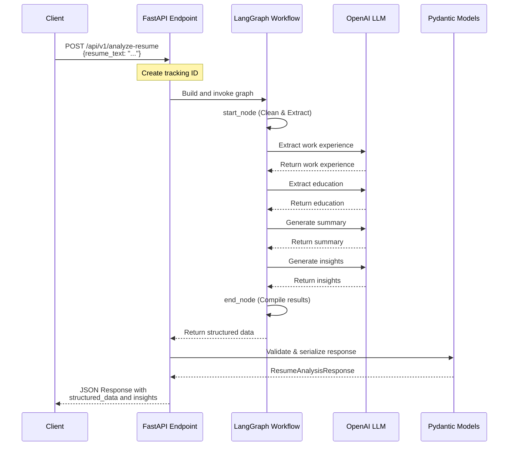
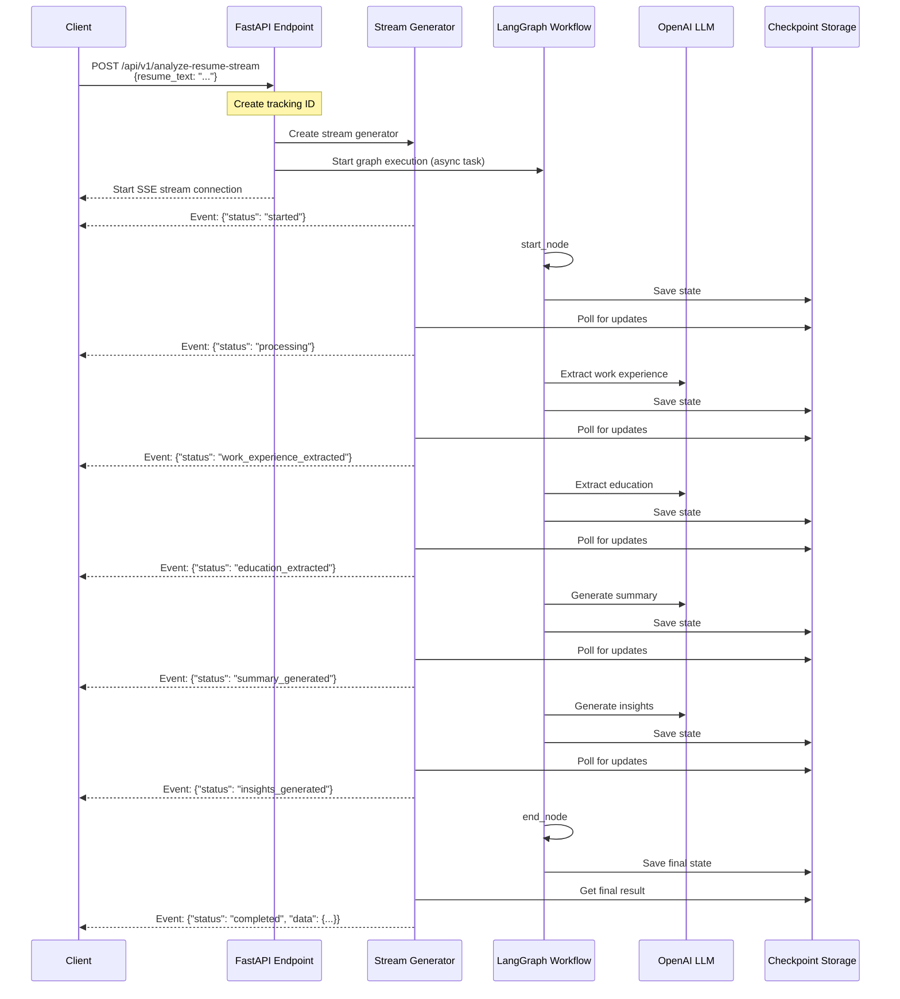
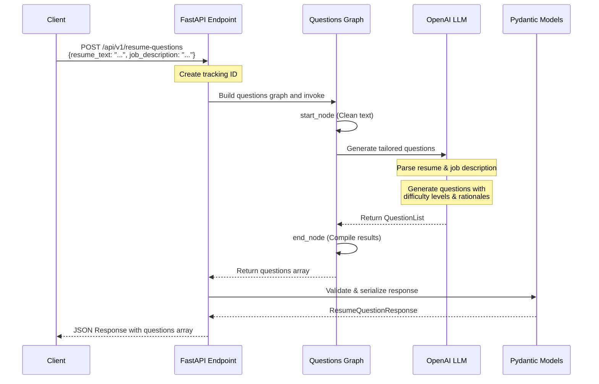
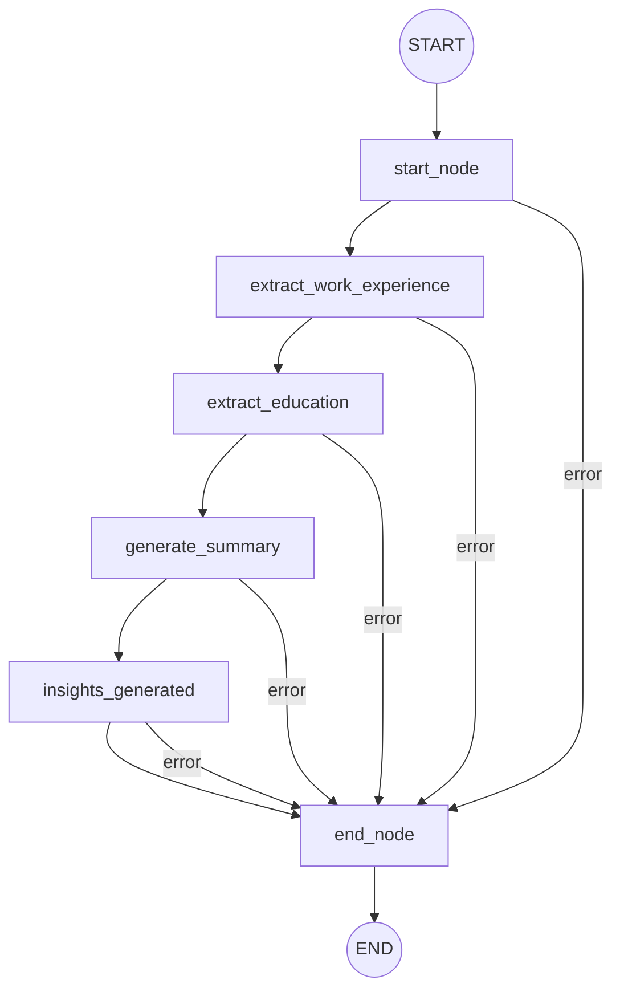
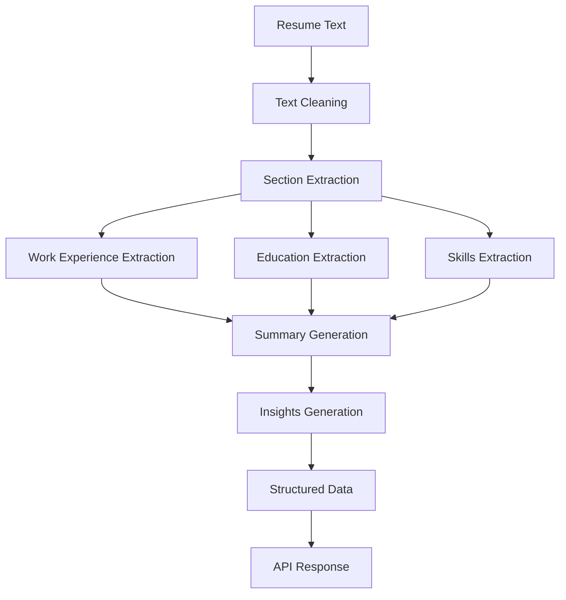
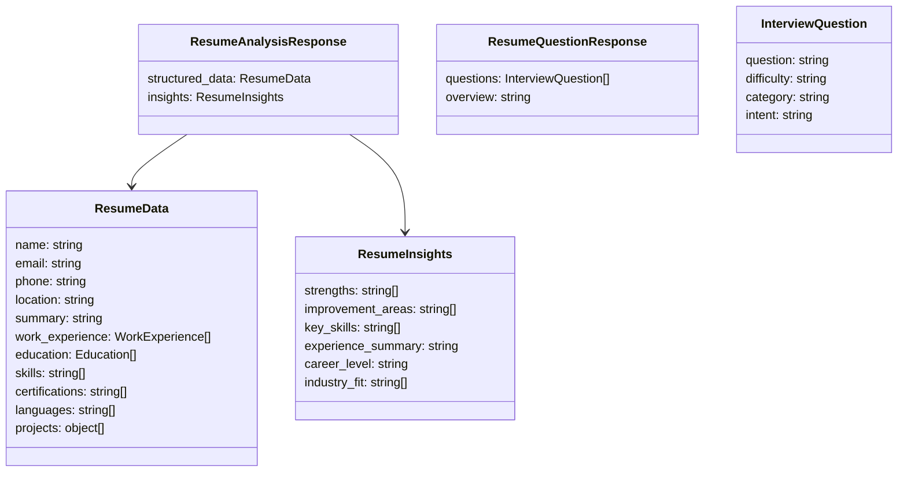

# Resume Analysis API Architecture

This document explains the architecture of the Resume Analysis API using diagrams to visualize the flow of data through the system.

## API Endpoints Overview

The Resume Analysis API provides three main endpoints:
1. `/api/v1/analyze-resume` - Synchronous resume analysis
2. `/api/v1/analyze-resume-stream` - Streaming resume analysis
3. `/api/v1/resume-questions` - Generate interview questions

## Flow Diagrams

### 1. Analyze Resume Endpoint

This diagram shows the flow of data when using the synchronous resume analysis endpoint:

### 2. Streaming Resume Analysis Endpoint

This diagram shows the streaming endpoint which provides real-time progress updates:

### 3. Generate Interview Questions Endpoint

This diagram shows how the interview questions generation endpoint works:

## Internal Components

### LangGraph Architecture

The Resume Analysis API uses LangGraph to orchestrate the resume analysis process. Below is a diagram showing the graph structure:

### Data Processing Flow

This diagram shows how the resume data flows through the system:

## API Response Structure

The API returns structured data in JSON format. Here's a simplified view of the response structure:

## Conclusion

The Resume Analysis API uses a modular, graph-based architecture to process resumes in a structured manner. The system leverages large language models (LLMs) to extract information, generate insights, and create interview questions. The API offers both synchronous and streaming endpoints for flexibility and real-time progress updates.
